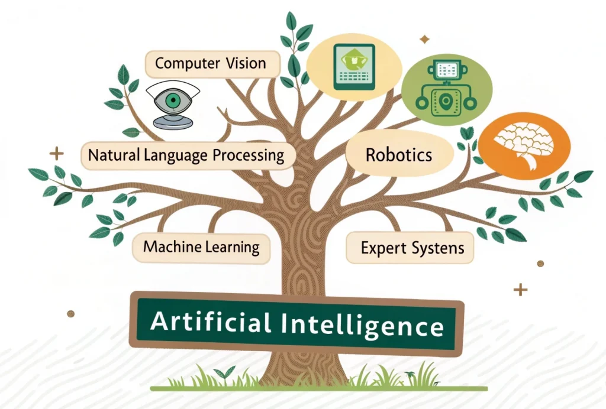

#  Day 1 — Introduction to Artificial Intelligence (AI)

Welcome to **Day 1** of my learning journey in the *Cracking FAANG: AI Foundations to LLMs Intensive* course.  
This day focused on understanding the fundamentals of **Artificial Intelligence**, its types, and key application areas.

---

## 📑 Table of Contents
- [Day 1 — Introduction to Artificial Intelligence (AI)](#day-1--introduction-to-artificial-intelligence-ai)
  - [📑 Table of Contents](#-table-of-contents)
  - [What is Artificial Intelligence?](#what-is-artificial-intelligence)
  - [🧠 Categories of AI](#-categories-of-ai)
  - [Domains \& Applications of AI](#domains--applications-of-ai)
    - [1️. Computer Vision](#1️-computer-vision)
    - [2️. Natural Language Processing (NLP)](#2️-natural-language-processing-nlp)
    - [3️. Robotics](#3️-robotics)
  - [🧰 Tools that will be Used](#-tools-that-will-be-used)
  - [📚 Resources \& Next Steps](#-resources--next-steps)
  - [Reflection](#reflection)

---

##  What is Artificial Intelligence?

**Artificial Intelligence (AI)** is the ability of a machine to perform tasks that are typically associated with **human intelligence**, such as learning, reasoning, problem-solving, and perception.

---

## 🧠 Categories of AI

| Type | Description | Example |
|------|--------------|----------|
| **ANI (Artificial Narrow Intelligence)** | Systems specialized for a single specific task. | Spam filters, recommendation systems |
| **AGI (Artificial General Intelligence)** | Capable of understanding and solving problems across multiple domains. | Still theoretical |
| **ASI (Artificial Super Intelligence)** | A speculative form of intelligence surpassing human cognitive abilities. | Future concept, seen in sci-fi |

---

## Domains & Applications of AI

AI powers several key domains and technologies that shape real-world innovation.

### 1️. Computer Vision
**Definition:** Enables machines to extract and interpret meaningful information from images and videos.  
**Common Tasks:** Classification, Detection, Segmentation, Tracking  
**Applications:** Medical imaging, OCR (Optical Character Recognition)  
**Techniques:** CNNs, Transfer Learning, Object Detection  

### 2️. Natural Language Processing (NLP)
**Definition:** Enables computers to understand, generate, and interact using human language.  
**Applications:** Chatbots, Machine Translation, Summarization, Information Retrieval, Sentiment Analysis  
**Core Techniques:** Tokenization, Embeddings, Transformers (BERT, GPT)  

### 3️. Robotics
**Definition:** Integrates hardware and AI for perception, planning, control, and interaction.  
**Applications:** Industrial automation, Mobile robots, Surgical robots  
**Key Topics:** Kinematics, Dynamics, Motion Planning, Control, Sensors & Actuators  

---

## 🧰 Tools that will be Used 

| Tool | Purpose |
|------|----------|
| **Python** | Dominant language for AI due to its rich ecosystem of libraries (NumPy, TensorFlow, PyTorch). |
| **Jupyter Notebook** | Interactive environment ideal for experiments, exploration, and demonstrations. |
| **Git** | Version control tool to manage code and track project changes. |

**Setup completed:** Installed Python, Jupyter, and Git → Tested basic commands successfully ✅

---

## 📚 Resources & Next Steps

- [Python Official Docs](https://docs.python.org/3/)
- [Jupyter Documentation](https://jupyter.org/)
- [Git Basics Guide](https://git-scm.com/docs/gittutorial)

---

## Reflection

> “AI is not magic — it’s math, logic, and learning combined with creativity.”

I learned that AI is a vast field built upon fundamental concepts like perception, reasoning, and learning.  
Excited to move toward the **mathematical foundations** that power intelligent systems.

---

📌 *Check my daily progress log here → [progress_log.md](../progress_log.md)*
